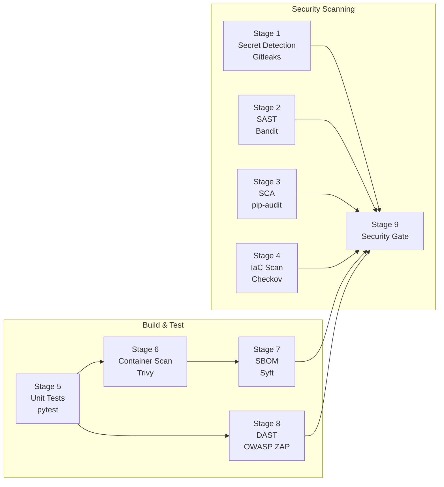

# DevSecOps Pipeline Reference

[](https://github.com/YOUR_USERNAME/devsecops-pipeline-reference/actions/workflows/security-pipeline.yml)

A production-grade **9-stage DevSecOps security pipeline** built with GitHub Actions, demonstrating end-to-end security automation for a Python FastAPI application deployed on AWS ECS Fargate.

> **The pipeline is the star** — the app is scaffolding to give every scanner something real to analyze.

---

## Pipeline Architecture



## Security Tools

| Stage | Tool | Purpose | Output |
|-------|------|---------|--------|
| 1 | **Gitleaks** | Secret detection in git history | Pass/Fail |
| 2 | **Bandit** | Python SAST (static analysis) | SARIF → GitHub Security |
| 3 | **pip-audit** | Dependency vulnerability scan | JSON artifact |
| 4 | **Checkov** | Terraform/IaC misconfiguration | SARIF → GitHub Security |
| 5 | **pytest** | Unit & integration tests | Pass/Fail |
| 6 | **Trivy** | Container image CVE scan | SARIF → GitHub Security |
| 7 | **Syft** | SBOM generation (SPDX + CycloneDX) | Artifact |
| 8 | **OWASP ZAP** | Dynamic application scan | HTML report |
| 9 | **Security Gate** | Aggregate pass/fail decision | Pipeline status |

## Intentional Findings

Low/medium severity findings are planted so every scanner has something to demonstrate:

| Scanner | Finding | Severity | Location |
|---------|---------|----------|----------|
| Bandit | B105 — hardcoded default SECRET_KEY | LOW | `app/config.py` |
| Bandit | B311 — `random.randint()` for non-crypto use | LOW | `app/auth.py` |
| pip-audit | CVE(s) in python-jose 3.3.0 | LOW/MED | `requirements.txt` |
| Checkov | CKV_AWS_91 — ALB logging disabled | MEDIUM | `terraform/alb.tf` |
| Checkov | CKV_AWS_2 — HTTP listener (no HTTPS) | MEDIUM | `terraform/alb.tf` |
| Checkov | CKV_AWS_136 — ECR no KMS encryption | MEDIUM | `terraform/ecr.tf` |
| Checkov | CKV_AWS_158 — Log group no KMS | LOW | `terraform/ecs.tf` |
| Trivy | OS package CVEs in python:3.11-slim | LOW/MED | `Dockerfile` |
| ZAP | Missing security headers / permissive CORS | LOW | `app/main.py` |
| Dependabot | Outdated FastAPI version | INFO | `requirements.txt` |

All findings are LOW/MEDIUM — the Security Gate passes (it only fails on CRITICAL/HIGH).

## Quick Start

### Prerequisites
- Python 3.11+
- Docker (optional)
- Terraform (optional, for IaC validation)

### Local Development

```bash
# Clone and install
git clone https://github.com/YOUR_USERNAME/devsecops-pipeline-reference.git
cd devsecops-pipeline-reference
python -m venv venv && source venv/bin/activate  # or venv\Scripts\activate on Windows
pip install -r requirements-dev.txt

# Run the API
uvicorn app.main:app --reload
# Visit http://localhost:8000/docs for Swagger UI

# Run tests
pytest tests/ -v

# Run security scans locally
bandit -r app/ -c .bandit.yml
pip-audit -r requirements.txt
```

### Docker

```bash
docker build -t devsecops-task-api .
docker run -p 8000:8000 devsecops-task-api
```

### Terraform Validation

```bash
pip install checkov
checkov -d terraform/
```

## API Endpoints

| Method | Endpoint | Description | Auth |
|--------|----------|-------------|------|
| GET | `/health` | Health check | No |
| POST | `/auth/register` | Create account | No |
| POST | `/auth/login` | Get JWT token | No |
| GET | `/tasks/` | List user tasks | JWT |
| POST | `/tasks/` | Create task | JWT |
| GET | `/tasks/{id}` | Get task | JWT |
| PATCH | `/tasks/{id}` | Update task | JWT |
| DELETE | `/tasks/{id}` | Delete task | JWT |

## Project Structure

```
devsecops-pipeline-reference/
├── .github/workflows/    # 9-stage security pipeline
├── app/                  # FastAPI application
│   ├── routers/          # API route handlers
│   ├── auth.py           # JWT authentication
│   ├── config.py         # Pydantic settings
│   ├── database.py       # SQLAlchemy setup
│   ├── models.py         # ORM models
│   └── schemas.py        # Request/response schemas
├── terraform/            # AWS ECS Fargate IaC
├── tests/                # pytest test suite
├── Dockerfile            # Multi-stage, non-root
└── SECURITY.md           # STRIDE threat model
```

## License

[MIT](LICENSE)
