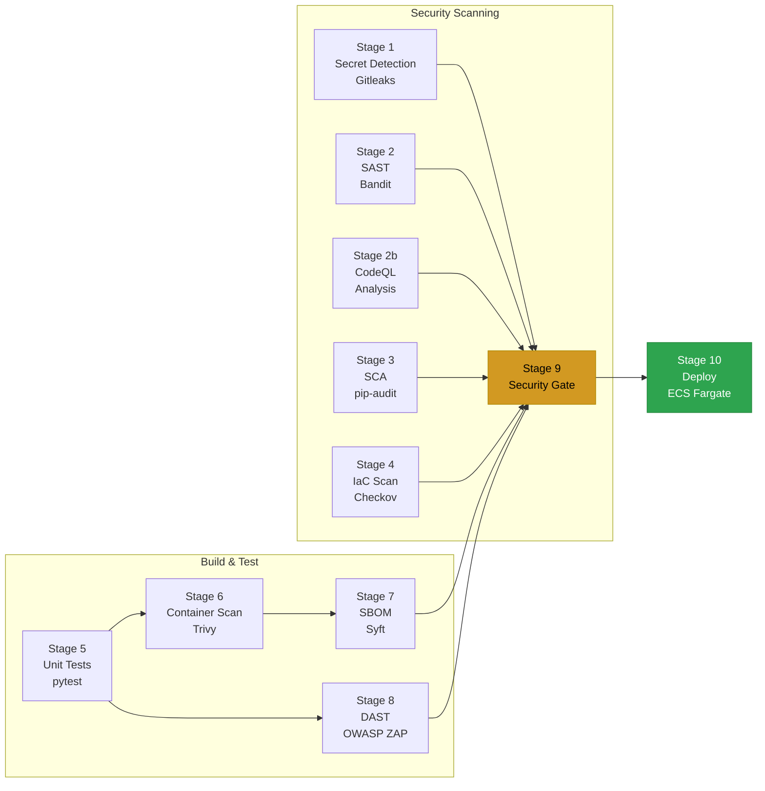

# DevSecOps Pipeline Reference

[](https://github.com/n1ops/devsecops-pipeline-reference/actions/workflows/security-pipeline.yml)

## Overview

In most software teams, security is an afterthought — developers write code, ship it, and hope nothing goes wrong. **DevSecOps** flips that model by embedding security checks directly into the development workflow so that vulnerabilities are caught automatically, every single time code changes, before it ever reaches users.

This project is a complete, working example of that approach. It pairs a real Python web API (a task management service built with FastAPI) with an **automated security pipeline** that runs **11 stages of checks** every time code is pushed or a pull request is opened. The pipeline scans for leaked secrets, known vulnerabilities in dependencies, insecure code patterns, cloud infrastructure misconfigurations, and more — then makes a pass/fail decision before anything is allowed to deploy.

### What the pipeline checks (and why)

| What gets checked | Why it matters | Tool |
|---|---|---|
| **Secrets in code** | API keys or passwords accidentally committed to git can be exploited within minutes | Gitleaks |
| **Insecure code patterns** | Common mistakes like hardcoded passwords or shell injection are caught before review | Bandit, CodeQL |
| **Vulnerable dependencies** | Open-source libraries ship with known CVEs that attackers actively scan for | pip-audit |
| **Cloud misconfigurations** | A single overly-permissive IAM policy or unencrypted database can expose an entire system | Checkov |
| **Application tests** | 73 tests verify authentication, authorization, rate limiting, input validation, and data isolation | pytest |
| **Container vulnerabilities** | The Docker image's OS packages and libraries are scanned for known CVEs | Trivy |
| **Software bill of materials** | A full inventory of every component in the container, required for supply chain compliance | Syft |
| **Live application scanning** | A real attack proxy crawls and probes the running API for XSS, injection, and missing headers | OWASP ZAP |

If any critical check fails — leaked secrets, failing tests, vulnerable dependencies, or container CVEs — the pipeline blocks deployment automatically. Non-critical findings (like informational IaC warnings) are tracked but don't stop the release.

When everything passes, the pipeline deploys to **AWS ECS Fargate** using keyless OIDC authentication (no stored AWS credentials in GitHub). The infrastructure — VPC, load balancer, WAF, encrypted logging, secrets management — is fully defined in **Terraform** and follows AWS security best practices.

### Who this is for

- **Engineers** looking for a reference implementation of a real DevSecOps pipeline
- **Security teams** evaluating which tools to integrate into CI/CD
- **Students and career-changers** learning how modern application security works in practice
- **Hiring managers** reviewing a portfolio project that demonstrates security engineering depth

> **The pipeline is the star** — the application exists to give every scanner something real to analyze, but is itself hardened to production standards.

---

## Table of Contents

- [Overview](#overview)
- [Pipeline Architecture](#pipeline-architecture)
- [Security Pipeline Deep Dive](#security-pipeline-deep-dive)
- [Application Security](#application-security)
- [Infrastructure Security](#infrastructure-security)
- [Test Suite](#test-suite)
- [STRIDE Threat Model](#stride-threat-model)
- [Quick Start](#quick-start)
- [Deployment](#deployment)
- [How to Use This Pipeline](#how-to-use-this-pipeline)
- [API Reference](#api-reference)
- [Project Structure](#project-structure)
- [License](#license)

---

## Pipeline Architecture



Every push and pull request runs all 11 stages. The security gate enforces policy before any code reaches production. Deployment is gated to the `main` branch only, after all stages pass, and uses keyless OIDC authentication to AWS.

---

## Security Pipeline Deep Dive

### Stage 1: Secret Detection (Gitleaks)

Scans the entire git history for leaked credentials, API keys, tokens, and other secrets. Runs on every commit with full `fetch-depth: 0` to catch secrets buried in history, not just the latest diff.

**Gate classification:** CRITICAL — pipeline fails immediately on findings.

### Stage 2: SAST (Bandit)

Static Application Security Testing for Python. Analyzes source code for common security anti-patterns — hardcoded passwords (B105), insecure random (B311), SQL injection, shell injection, and more. Results are uploaded as SARIF to the GitHub Security tab for tracking and triage.

**Configuration:** `.bandit.yml` excludes test directories.

### Stage 2b: CodeQL Analysis

GitHub's semantic code analysis engine provides a second layer of SAST with deeper interprocedural analysis. Runs the `security-extended` query suite, catching data flow vulnerabilities like tainted input propagation that rule-based scanners miss. Results appear in the GitHub Security tab alongside Bandit findings.

### Stage 3: SCA (pip-audit)

Software Composition Analysis scans all Python dependencies against the OSV and PyPI advisory databases. Identifies known CVEs in transitive dependencies. Results are archived as JSON artifacts.

**Gate classification:** CRITICAL — pipeline fails on vulnerable dependencies.

### Stage 4: IaC Scan (Checkov)

Scans all Terraform configurations for cloud security misconfigurations — missing encryption, overly permissive IAM policies, public S3 buckets, missing logging, and 750+ other CIS/AWS best practice checks. Results uploaded as SARIF.

### Stage 5: Unit Tests (pytest)

Runs the full 73-test suite covering authentication, authorization, input validation, rate limiting, security headers, IDOR protection, and more. Tests run against an in-memory SQLite database with isolated fixtures.

**Gate classification:** CRITICAL — pipeline fails on any test failure.

### Stage 6: Container Scan (Trivy)

Scans the built Docker image for OS package CVEs, language library vulnerabilities, and misconfigurations. Uses `.trivyignore` for accepted risks. The built image is saved as a tarball artifact for downstream stages — the image is built once and never rebuilt, preserving provenance.

**Gate classification:** CRITICAL — pipeline fails on CRITICAL/HIGH severity CVEs.

### Stage 7: SBOM Generation (Syft)

Generates a complete Software Bill of Materials in both **SPDX** and **CycloneDX** formats. The SBOM catalogs every OS package and Python library in the container image, enabling supply chain transparency and downstream vulnerability tracking.

### Stage 8: DAST (OWASP ZAP)

Dynamic Application Security Testing runs the ZAP baseline scanner against the live application. The app is started with `uvicorn` and ZAP performs automated crawling and passive/active scanning for XSS, injection, information disclosure, and missing security headers.

### Stage 9: Security Gate

Aggregates results from all upstream stages and enforces pass/fail policy:

| Failure Condition | Result |
|---|---|
| Secret detection findings | **FAIL** |
| Unit test failures | **FAIL** |
| Container CVEs (CRITICAL/HIGH) | **FAIL** |
| Vulnerable dependencies | **FAIL** |
| SAST/IaC/DAST findings | Tracked in Security tab (non-blocking) |

The gate outputs a formatted summary showing every stage result. Non-critical findings are tracked but don't block deployment.

### Stage 10: Deploy to ECS

Runs only on push to `main` after the security gate passes. Uses **keyless OIDC federation** (no stored AWS credentials) to authenticate GitHub Actions to AWS. The deployment:

1. Authenticates to ECR via OIDC
2. Loads the image tarball artifact (same image that was scanned)
3. Tags and pushes to ECR
4. Registers a new ECS task definition revision
5. Updates the ECS service with rolling deployment
6. Waits for deployment stability

**Concurrency control:** Only one deployment can run at a time (`cancel-in-progress: false`).

---

## Application Security

The FastAPI application implements defense-in-depth with multiple overlapping security controls.

### Authentication & Token Management

| Control | Implementation |
|---|---|
| Password hashing | bcrypt with random salt per user |
| Password complexity | Minimum 8 chars, requires uppercase + lowercase + digit + special character |
| Password reuse prevention | Server rejects new password identical to current |
| JWT tokens | HS256 with `exp`, `iat`, `iss`, `aud`, `jti` claims |
| Token revocation | JTI-based blocklist; logout and password change both revoke tokens |
| Token refresh | `POST /auth/refresh` rotates tokens atomically (revoke old, issue new) |
| Account lockout | 5 failed attempts triggers 15-minute lockout |
| Lockout reset | Successful login atomically resets counter to zero |
| Timing equalization | Failed logins for non-existent users perform a dummy bcrypt verify to prevent timing-based user enumeration |
| Generic error messages | Login failures return `"Invalid username or password"` regardless of whether the user exists or the password is wrong |
| Token `jti` required | Tokens without a `jti` claim are rejected, preventing blocklist bypass |
| Expired token cleanup | `cleanup_expired_tokens()` utility purges stale blocklist entries |

### Race Condition Protection

Login counters use atomic SQL UPDATE expressions to prevent race conditions in concurrent requests:

```python
# Atomic increment — no read-modify-write race
db.execute(
    update(User).where(User.id == user.id)
    .values(failed_login_attempts=User.failed_login_attempts + 1)
)
```

### Middleware Stack (Pure ASGI)

All middleware is implemented as pure ASGI callables (not Starlette `BaseHTTPMiddleware`) for maximum performance and compatibility:

```
Request → SecurityHeaders → RequestID → MaxBodySize → CORS → SlowAPI → Router
                                                                          ↓
Response ← SecurityHeaders ← RequestID ← MaxBodySize ← CORS ← SlowAPI ← Router
```

| Middleware | Purpose |
|---|---|
| **SecurityHeadersMiddleware** | Injects 9 security headers on every response (including errors) |
| **RequestIDMiddleware** | Generates UUID v4 per request, returned in `X-Request-Id` header |
| **MaxBodySizeMiddleware** | Rejects bodies >1MB via both Content-Length check and streaming byte counter (defeats chunked encoding bypass) |
| **CORSMiddleware** | Wildcard origins in debug; explicit origins in production. Credentials disabled when origin is `*` |
| **SlowAPIMiddleware** | Per-endpoint rate limiting with configurable limits |

### Security Headers

Every response (including 404s and 500s) includes:

| Header | Value |
|---|---|
| `X-Content-Type-Options` | `nosniff` |
| `X-Frame-Options` | `DENY` |
| `X-XSS-Protection` | `0` (modern browsers; CSP is the real defense) |
| `Strict-Transport-Security` | `max-age=31536000; includeSubDomains` |
| `Referrer-Policy` | `strict-origin-when-cross-origin` |
| `Permissions-Policy` | `camera=(), microphone=(), geolocation=()` |
| `Content-Security-Policy` | `default-src 'none'; frame-ancestors 'none'` |
| `Cross-Origin-Opener-Policy` | `same-origin` |
| `Cross-Origin-Resource-Policy` | `same-origin` |
| `Cache-Control` | `no-store, no-cache, must-revalidate` (API routes only) |
| `Pragma` | `no-cache` (API routes only) |
| `X-Request-Id` | UUID v4 per request |

### Rate Limiting

| Endpoint | Limit | Retry-After |
|---|---|---|
| `POST /auth/register` | 5/minute | 60s |
| `POST /auth/login` | 5/minute | 60s |
| `POST /auth/change-password` | 3/minute | 60s |
| `POST /auth/refresh` | 5/minute | 60s |
| `GET /tasks/` | 30/minute | 60s |
| `POST /tasks/` | 10/minute | 60s |
| `GET /tasks/{id}` | 30/minute | 60s |
| `PATCH /tasks/{id}` | 20/minute | 60s |
| `DELETE /tasks/{id}` | 10/minute | 60s |
| All other routes (default) | 100/minute | 60s |

All 429 responses include the `Retry-After: 60` header. Rate limiting keys on the client IP extracted from `X-Forwarded-For` (ALB-aware, takes the rightmost entry to prevent spoofing).

### Input Validation

| Field | Constraint |
|---|---|
| Username | 3-50 chars, alphanumeric + hyphens + underscores only (`^[a-zA-Z0-9_-]+$`) |
| Password | 8-128 chars, must contain upper + lower + digit + special |
| Task title | 1-200 chars |
| Task description | 0-1000 chars |
| Pagination `limit` | 1-100 |
| Pagination `skip` | >= 0 |
| Request body | Max 1MB |

### Authorization & Data Isolation

- All task endpoints require JWT authentication
- Row-level security: users can only access their own tasks (`Task.owner_id == current_user.id`)
- IDOR protection: accessing another user's task returns 404 (not 403) to prevent ID enumeration
- Mass assignment protection: PATCH endpoint only allows `title`, `description`, `completed` fields — `owner_id` is explicitly excluded

### Error Handling

- Generic 500 handler catches all unhandled exceptions and returns `{"detail": "Internal server error"}` — no stack traces, no internal paths, no exception messages
- OpenAPI docs (`/docs`, `/redoc`, `/openapi.json`) are disabled when `DEBUG=false`
- Startup fails immediately if `SECRET_KEY` is the default development value in non-debug mode

---

## Infrastructure Security

### Network Architecture

```
┌───────────────────────────────────────────────────┐
│                     VPC (10.0.0.0/16)             │
│                                                   │
│  ┌─────────────────┐    ┌─────────────────┐       │
│  │  Public Subnet   │    │  Public Subnet   │      │
│  │  10.0.0.0/24     │    │  10.0.1.0/24     │      │
│  │                  │    │                  │       │
│  │  ┌────────────┐  │    │                  │      │
│  │  │    ALB     │  │    │                  │       │
│  │  │ + WAF ACL  │  │    │                  │      │
│  │  └─────┬──────┘  │    │                  │       │
│  └────────┼─────────┘    └──────────────────┘      │
│           │ NAT Gateway                            │
│  ┌────────┼─────────┐    ┌─────────────────┐       │
│  │  Private Subnet  │    │  Private Subnet  │      │
│  │  10.0.10.0/24    │    │  10.0.11.0/24    │      │
│  │                  │    │                  │       │
│  │  ┌────────────┐  │    │  ┌────────────┐  │      │
│  │  │  ECS Task  │  │    │  │  ECS Task  │  │      │
│  │  │  (Fargate) │  │    │  │  (Fargate) │  │      │
│  │  └────────────┘  │    │  └────────────┘  │      │
│  └──────────────────┘    └──────────────────┘      │
│                                                   │
│  VPC Flow Logs → CloudWatch (KMS encrypted)        │
└───────────────────────────────────────────────────┘
```

### AWS Resources

| Resource | Security Feature |
|---|---|
| **VPC** | Private subnets for ECS tasks; public subnets for ALB only |
| **ALB** | Drop invalid headers enabled; access logs to S3; HTTPS with TLS 1.3 (when domain configured) |
| **WAF** | 3 AWS managed rule groups: CommonRuleSet, KnownBadInputs, SQLiRuleSet |
| **ECS Tasks** | Private subnets, no public IP, security group allows only ALB ingress |
| **Container** | Non-root user, read-only root filesystem, all Linux capabilities dropped |
| **ECR** | Immutable image tags, scan-on-push enabled, lifecycle policy (keep last 10) |
| **Secrets Manager** | `random_password` resource generates 64-char secret; injected at runtime via ECS secrets |
| **CloudWatch** | KMS-encrypted log groups with 30-day retention; VPC Flow Logs |
| **KMS** | Automatic key rotation enabled; scoped policy for CloudWatch Logs service |
| **CloudWatch Alarms** | CPU >80%, Memory >80%, ALB 5xx >10 — all wired to SNS topic |
| **SNS** | Alert topic with optional email subscription for alarm notifications |
| **IAM** | Least-privilege roles: ECS execution role (ECR pull + Secrets Manager), task role (CloudWatch write-only) |
| **OIDC** | Keyless GitHub Actions authentication; deploy role scoped to `main` branch and `production` environment |
| **S3** | ALB log bucket with public access block, server-side encryption, 90-day lifecycle expiration |
| **NAT Gateway** | Enables private subnet outbound access for ECR image pulls and CloudWatch log delivery |

### HTTP to HTTPS

When `domain_name` is provided, the infrastructure automatically:

1. Provisions an ACM certificate with DNS validation
2. Creates an HTTPS listener on port 443 with `ELBSecurityPolicy-TLS13-1-2-2021-06`
3. Redirects all HTTP (port 80) traffic to HTTPS with 301

When no domain is configured, the ALB serves HTTP directly (development/demo mode).

### CODEOWNERS

Security-critical paths require review from `@n1ops`:

```
/.github/       @n1ops
/terraform/     @n1ops
/Dockerfile     @n1ops
/app/auth.py    @n1ops
/app/config.py  @n1ops
.bandit.yml     @n1ops
.trivyignore    @n1ops
```

---

## Test Suite

**73 tests** across 4 test files, covering security controls end-to-end.

### Authentication Tests (34 tests)

| Test | What It Verifies |
|---|---|
| `test_register_success` | 201 response with username and id |
| `test_register_duplicate` | 409 on duplicate username |
| `test_login_success` | 200 with access_token |
| `test_login_wrong_password` | 401 on wrong password |
| `test_register_weak_password` | 422 on password without complexity |
| `test_login_nonexistent_user` | 401 (not 404) for non-existent users |
| `test_login_weak_password_accepted_at_login` | Login schema doesn't enforce complexity |
| `test_account_lockout` | 401 after 5 failed attempts (prevents enumeration) |
| `test_logout` | Token works before logout, 401 after |
| `test_change_password` | 200 + can login with new password |
| `test_change_password_wrong_current` | 401 on wrong current password |
| `test_register_invalid_username` | 422 on special characters |
| `test_register_username_with_special_chars` | 422 on XSS in username |
| `test_invalid_token` | 401 on garbage token |
| `test_empty_token` | 401 on empty bearer |
| `test_double_logout` | Second logout returns 401 (not 500) |
| `test_change_password_revokes_token` | Old token fails after password change |
| `test_expired_token_rejected` | 401 on expired JWT |
| `test_token_wrong_secret_rejected` | 401 on JWT signed with wrong key |
| `test_token_wrong_audience_rejected` | 401 on wrong `aud` claim |
| `test_token_wrong_issuer_rejected` | 401 on wrong `iss` claim |
| `test_token_missing_sub_claim_rejected` | 401 on JWT without `sub` |
| `test_token_none_algorithm_rejected` | 401 on `alg: none` attack |
| `test_register_response_no_password_leak` | No `hashed_password` in response |
| `test_malformed_json_body` | 422 on invalid JSON (not 500) |
| `test_register_missing_fields` | 422 on missing username/password |
| `test_register_oversized_username` | 422 on 100-char username |
| `test_register_oversized_password` | 422 on 200-char password |
| `test_lockout_expires` | Account unlocks after lockout period |
| `test_change_password_reuse_rejected` | 400 when new password == current |
| `test_register_duplicate_generic_message` | No "already registered" in error (prevents enumeration) |
| `test_token_missing_jti_rejected` | 401 on JWT without `jti` (blocklist bypass prevention) |
| `test_refresh_token` | New token works, old token revoked |
| `test_cleanup_expired_tokens` | Expired blocklist entries purged, valid ones retained |

### Health & Middleware Tests (11 tests)

| Test | What It Verifies |
|---|---|
| `test_health_check` | 200 with status and service name |
| `test_security_headers` | All 9 security headers present with correct values |
| `test_request_id_header` | UUID v4 in `X-Request-Id` |
| `test_cache_control_on_api` | `no-store, no-cache` on API routes |
| `test_error_response_no_stack_trace` | No `Traceback` or file paths in 404 body |
| `test_docs_hidden_in_production` | `/docs` available in debug mode |
| `test_cors_preflight` | CORS headers on OPTIONS requests |
| `test_body_size_limit_rejected` | 413 on body >1MB |
| `test_docs_hidden_when_debug_false` | `/docs` returns 404 when `DEBUG=false` |
| `test_security_headers_on_error_responses` | Security headers present on 404 responses |
| `test_generic_exception_handler_returns_safe_json` | 500 returns `{"detail": "Internal server error"}`, no stack trace |

### Rate Limit Tests (9 tests)

| Test | What It Verifies |
|---|---|
| `test_login_rate_limit` | 429 after 5 login attempts/min |
| `test_register_rate_limit` | 429 after 5 registrations/min |
| `test_change_password_rate_limit` | 429 after 3 password changes/min |
| `test_task_create_rate_limit` | 429 after 10 task creates/min |
| `test_task_list_rate_limit` | 429 after 30 list requests/min |
| `test_task_get_rate_limit` | 429 after 30 get requests/min |
| `test_task_update_rate_limit` | 429 after 20 update requests/min |
| `test_task_delete_rate_limit` | 429 after 10 delete requests/min |
| `test_rate_limit_returns_retry_after_header` | `Retry-After: 60` header on 429 responses |

### Task & Authorization Tests (19 tests)

| Test | What It Verifies |
|---|---|
| `test_create_task` | 201 with title and `completed: false` |
| `test_list_tasks` | Returns only user's tasks |
| `test_get_task` | 200 with correct task data |
| `test_update_task` | PATCH updates title and completed |
| `test_delete_task` | 204 + subsequent GET returns 404 |
| `test_unauthorized_access` | 401 without token |
| `test_task_not_found` | 404 on non-existent task |
| `test_idor_get_other_users_task` | 404 when user B tries to GET user A's task |
| `test_idor_update_other_users_task` | 404 when user B tries to PATCH user A's task |
| `test_idor_delete_other_users_task` | 404 when user B tries to DELETE user A's task |
| `test_idor_list_only_own_tasks` | Each user sees only their own tasks |
| `test_pagination_default` | Default pagination returns all (up to limit) |
| `test_pagination_limit` | `?limit=3` returns exactly 3 |
| `test_pagination_skip` | `?skip=3` skips first 3 |
| `test_pagination_limit_exceeds_max` | 422 on `?limit=200` (max is 100) |
| `test_mass_assignment_owner_id_ignored` | PATCH with `owner_id` doesn't change ownership |
| `test_sql_injection_in_task_title` | SQLi payload stored as plain text, tables intact |
| `test_create_task_empty_title` | 422 on empty string title |
| `test_create_task_oversized_title` | 422 on 300-char title |

---

## STRIDE Threat Model

| Category | Threat | Mitigation | Status |
|---|---|---|---|
| **Spoofing** | Unauthorized API access | JWT auth with bcrypt password hashing | Implemented |
| **Spoofing** | Token forgery | HS256 JWT with iss/aud/jti claims; configurable secret via Secrets Manager | Implemented |
| **Spoofing** | User enumeration via timing | Dummy bcrypt verify on non-existent user lookups | Implemented |
| **Spoofing** | User enumeration via error messages | Generic "Invalid username or password" on all login failures | Implemented |
| **Spoofing** | Algorithm confusion (`alg: none`) | Explicit algorithm allowlist in `jwt.decode()` | Implemented |
| **Spoofing** | Unauthorized deployment | OIDC federation restricts deploy to `main` branch only | Implemented |
| **Tampering** | SQL injection | SQLAlchemy ORM parameterized queries | Implemented |
| **Tampering** | Mass assignment | Explicit allowlist of updatable fields | Implemented |
| **Tampering** | Request body manipulation | Pydantic schema validation with field constraints | Implemented |
| **Tampering** | Container image tampering | ECR immutable tags + scan-on-push + single-build provenance | Implemented |
| **Repudiation** | Untraceable API actions | Structured logging to CloudWatch with request IDs | Implemented |
| **Repudiation** | Unauthorized code changes | CODEOWNERS + branch protection + required pipeline | Implemented |
| **Information Disclosure** | Secret leakage in git | Gitleaks scanning with full history | Implemented |
| **Information Disclosure** | Stack trace leakage | Generic 500 handler; docs hidden in production | Implemented |
| **Information Disclosure** | Password hash in response | Response schema explicitly excludes `hashed_password` | Implemented |
| **Information Disclosure** | Dependency CVEs | pip-audit + Dependabot automated PRs | Implemented |
| **Information Disclosure** | Container OS CVEs | Trivy scanning + slim base image | Implemented |
| **Information Disclosure** | Network traffic visibility | VPC Flow Logs to CloudWatch (KMS encrypted) | Implemented |
| **Denial of Service** | Resource exhaustion | Fargate CPU/memory limits + per-endpoint rate limiting | Implemented |
| **Denial of Service** | Unbounded request body | 1MB body size limit (Content-Length + streaming byte counter) | Implemented |
| **Denial of Service** | Brute force login | Account lockout after 5 attempts + rate limiting | Implemented |
| **Elevation of Privilege** | Container breakout | Non-root user, read-only filesystem, all capabilities dropped, Fargate isolation | Implemented |
| **Elevation of Privilege** | IAM over-permissioning | Least-privilege: task role has CloudWatch write-only; deploy role scoped to ECR+ECS | Implemented |
| **Elevation of Privilege** | IDOR / cross-user access | Row-level ownership filter on all task queries | Implemented |

---

## Quick Start

### Prerequisites

- Python 3.11+
- Docker (optional, for container builds)
- Terraform >= 1.5 (optional, for infrastructure)

### Local Development

```bash
# Clone
git clone https://github.com/n1ops/devsecops-pipeline-reference.git
cd devsecops-pipeline-reference

# Install
python -m venv venv
source venv/bin/activate  # Windows: venv\Scripts\activate
pip install -r requirements-dev.txt

# Run the API (debug mode with Swagger UI at /docs)
DEBUG=true SECRET_KEY=dev-secret-key uvicorn app.main:app --reload

# Run the test suite
pytest tests/ -v

# Run security scans locally
bandit -r app/ -c .bandit.yml
pip-audit -r requirements.txt
```

### Docker

```bash
docker build -t devsecops-task-api .
docker run -p 8000:8000 -e SECRET_KEY=your-secret-key -e DEBUG=true devsecops-task-api
```

### Terraform Validation

```bash
pip install checkov
checkov -d terraform/
```

---

## Deployment

Stage 10 deploys to ECS Fargate on push to `main` after the security gate passes.

### 1. Provision Infrastructure

```bash
cd terraform
terraform init
terraform apply
```

This creates: VPC, subnets, NAT gateway, ALB, WAF, ECS cluster, ECR repository, Secrets Manager secret, CloudWatch log groups (KMS encrypted), IAM roles, OIDC provider, CloudWatch alarms, and SNS alerts.

### 2. Configure GitHub Secrets

| Secret | Value |
|---|---|
| `AWS_ROLE_ARN` | `terraform output -raw github_actions_role_arn` |

No `AWS_ACCESS_KEY_ID` or `AWS_SECRET_ACCESS_KEY` needed — the pipeline uses OIDC federation.

### 3. (Optional) Enable HTTPS

```bash
terraform apply -var="domain_name=api.yourdomain.com"
```

This provisions an ACM certificate, creates an HTTPS listener with TLS 1.3 policy, and redirects HTTP to HTTPS.

### 4. (Optional) Enable Alarm Notifications

```bash
terraform apply -var="alert_email=ops@yourdomain.com"
```

Creates an SNS email subscription for CPU, memory, and 5xx alarm notifications.

### 5. (Optional) GitHub Environment Protection

Create a `production` GitHub Environment with required reviewers for manual approval before deploy.

---

## How to Use This Pipeline

Once the infrastructure is provisioned and the GitHub secret is configured (see [Deployment](#deployment)), deploying code through the pipeline is straightforward. You don't run the pipeline manually — it runs automatically every time you push code or open a pull request.

### The day-to-day workflow

```
  You write code locally
        │
        ▼
  Push to a feature branch ──► Open a Pull Request
        │                              │
        │                   Pipeline runs automatically
        │                   (Stages 1-9, no deploy)
        │                              │
        │                    ┌─────────┴──────────┐
        │                    │                     │
        │              All stages pass       Something fails
        │                    │                     │
        │              Merge to main        Fix the issue,
        │                    │              push again
        │                    ▼              (pipeline re-runs)
        │            Pipeline runs again
        │            on main (Stages 1-10)
        │                    │
        │              Security Gate passes
        │                    │
        │                    ▼
        │            Auto-deploys to AWS ECS
        ▼
  Your changes are live
```

### Step by step

**1. Create a branch and make your changes**

```bash
git checkout -b feature/add-new-endpoint
# ... edit files ...
```

**2. Run checks locally before pushing (optional but recommended)**

```bash
# Run the test suite
pytest tests/ -v

# Run the SAST scanner
bandit -r app/ -c .bandit.yml

# Check dependencies for known vulnerabilities
pip-audit -r requirements.txt
```

These are the same tools the pipeline uses. Running them locally means fewer surprises when you push.

**3. Push your branch and open a pull request**

```bash
git push -u origin feature/add-new-endpoint
```

Then open a pull request on GitHub targeting `main`. The moment the PR is created (or updated with new commits), the pipeline starts automatically.

**4. Review the pipeline results**

Go to the **Actions** tab in the GitHub repository. You'll see the pipeline running with all 11 stages. Each stage shows a green checkmark or red X:

- **Green across the board** — your code passed all security checks. The PR is safe to merge.
- **Red on any stage** — click into the failed stage to see what went wrong. Common issues:
  - *Secret Detection failed* — you accidentally committed a credential. Remove it, rotate the secret, and push again.
  - *SCA failed* — a dependency has a known vulnerability. Update the package version in `requirements.txt`.
  - *Unit Tests failed* — a test is broken. Read the pytest output to see which test and why.
  - *SAST/IaC findings* — Bandit or Checkov found a code or infrastructure issue. Review the SARIF results in the Security tab.

**5. Merge to main**

Once the pipeline passes and the PR is reviewed, merge it into `main`. This triggers the pipeline again — but this time, because the code is going to `main`, **Stage 10 (Deploy)** is included.

If the Security Gate passes, the pipeline automatically:
1. Pushes your Docker image to AWS ECR
2. Registers a new ECS task definition
3. Rolls out the new version to ECS Fargate
4. Waits for the deployment to stabilize

You don't need to SSH into a server, run any deploy commands, or touch the AWS console. The pipeline handles everything.

**6. Verify the deployment**

After the pipeline finishes, your changes are live. You can verify by hitting the health check:

```bash
curl https://your-api-domain.com/health
```

### What happens if I push directly to main?

The pipeline runs the same way — all 11 stages including deploy. But in a team setting, you should use pull requests so the pipeline results are visible before code reaches `main`. Branch protection rules can enforce this.

### What if the deploy fails but all security stages passed?

The security gate (Stages 1-9) and the deploy (Stage 10) are separate. If the deploy fails — for example, because the ECS health check times out — your security stages are still green. The issue is operational (infrastructure, environment variables, resource limits), not a code security problem. Check the deploy step logs in the Actions tab for details.

### What if I only changed Terraform files?

The same pipeline runs. Checkov (Stage 4) will scan your infrastructure changes. The application stages (tests, container scan, DAST) still run to confirm nothing is broken. The deploy stage will push the same application image — Terraform changes need to be applied separately with `terraform apply`.

### Can I use this pipeline in a different project?

**Not by copying it directly** — but that's by design. This pipeline is a **reference architecture**, not a drop-in plugin. It's wired to this specific project's language (Python), directory structure (`app/`, `terraform/`, `tests/`), framework (FastAPI), and deployment target (ECS Fargate).

What you'd do is use this as a **template**: keep the same stage structure and swap out the tool-specific commands to match your stack. The 11-stage pattern works for any project — only the tools inside each stage change.

Here's what that looks like for common stacks:

| Stage | This Project (Python/FastAPI) | Node.js/Express | Go | Java/Spring Boot |
|---|---|---|---|---|
| **Secret Detection** | Gitleaks | Gitleaks | Gitleaks | Gitleaks |
| **SAST** | Bandit, CodeQL | ESLint security plugin, CodeQL | gosec, CodeQL | SpotBugs, CodeQL |
| **SCA** | pip-audit | `npm audit` | govulncheck | OWASP Dependency-Check |
| **IaC Scan** | Checkov | Checkov | Checkov | Checkov |
| **Unit Tests** | pytest | Jest / Mocha | `go test` | JUnit / Maven Surefire |
| **Container Scan** | Trivy | Trivy | Trivy | Trivy |
| **SBOM** | Syft | Syft | Syft | Syft |
| **DAST** | OWASP ZAP | OWASP ZAP | OWASP ZAP | OWASP ZAP |
| **Security Gate** | Custom logic | Custom logic | Custom logic | Custom logic |
| **Deploy** | ECS Fargate | ECS / Vercel / etc. | ECS / GKE / etc. | ECS / EKS / etc. |

Notice that some tools are **language-agnostic** (Gitleaks, Checkov, Trivy, Syft, ZAP) and work with zero changes. Others are language-specific and need to be swapped.

**To adapt this pipeline to your project, you would:**

1. **Copy** `.github/workflows/security-pipeline.yml` into your repo
2. **Keep** Stages 1, 4, 6, 7, 8, 9 mostly as-is (language-agnostic tools)
3. **Replace** Stage 2 (SAST) with a scanner for your language
4. **Replace** Stage 3 (SCA) with your language's dependency auditor
5. **Replace** Stage 5 (tests) with your test runner command
6. **Update** Stage 8 (DAST) to start your app instead of `uvicorn app.main:app`
7. **Update** Stage 10 (Deploy) with your deployment target and image name
8. **Update** the `env` block at the top with your image/cluster/service names

The security gate logic (Stage 9) works regardless of language — it only checks whether upstream stages passed or failed.

---

## API Reference

| Method | Endpoint | Description | Auth | Rate Limit |
|---|---|---|---|---|
| `GET` | `/health` | Health check | No | 100/min |
| `POST` | `/auth/register` | Create account | No | 5/min |
| `POST` | `/auth/login` | Get JWT token | No | 5/min |
| `POST` | `/auth/logout` | Revoke token | JWT | 100/min |
| `POST` | `/auth/change-password` | Change password + revoke token | JWT | 3/min |
| `POST` | `/auth/refresh` | Rotate token (revoke old, issue new) | JWT | 5/min |
| `GET` | `/tasks/` | List user's tasks (paginated) | JWT | 30/min |
| `POST` | `/tasks/` | Create task | JWT | 10/min |
| `GET` | `/tasks/{id}` | Get task by ID | JWT | 30/min |
| `PATCH` | `/tasks/{id}` | Update task | JWT | 20/min |
| `DELETE` | `/tasks/{id}` | Delete task | JWT | 10/min |

All authenticated endpoints require `Authorization: Bearer <token>` header. Tokens expire after 30 minutes.

---

## Project Structure

```
devsecops-pipeline-reference/
├── .github/
│   ├── CODEOWNERS                    # Security-critical path ownership
│   ├── dependabot.yml                # Automated dependency updates
│   └── workflows/
│       └── security-pipeline.yml     # 11-stage CI/CD security pipeline
├── app/
│   ├── routers/
│   │   ├── auth.py                   # Auth endpoints (register/login/logout/refresh/change-password)
│   │   ├── health.py                 # Health check endpoint
│   │   └── tasks.py                  # Task CRUD with IDOR protection
│   ├── auth.py                       # JWT creation, verification, revocation, blocklist cleanup
│   ├── config.py                     # Pydantic settings with startup safety check
│   ├── database.py                   # SQLAlchemy engine and session
│   ├── main.py                       # FastAPI app with ASGI middleware stack
│   ├── models.py                     # User, Task, TokenBlocklist ORM models
│   ├── rate_limit.py                 # slowapi config with ALB-aware IP extraction
│   └── schemas.py                    # Pydantic schemas with input validation
├── terraform/
│   ├── main.tf                       # Backend (S3 + DynamoDB lock) and provider
│   ├── variables.tf                  # Input variables (region, domain, alert_email, etc.)
│   ├── outputs.tf                    # Terraform outputs (role ARN, ALB DNS, etc.)
│   ├── networking.tf                 # VPC, subnets, NAT, security groups, VPC Flow Logs
│   ├── alb.tf                        # ALB, HTTPS/TLS, WAFv2, S3 access logs
│   ├── ecs.tf                        # ECS cluster, task def, service, KMS, CloudWatch alarms, SNS
│   ├── ecr.tf                        # ECR repository with immutable tags
│   ├── iam.tf                        # Least-privilege IAM roles and policies
│   ├── oidc.tf                       # GitHub Actions OIDC federation
│   └── secrets.tf                    # Secrets Manager with random_password
├── tests/
│   ├── conftest.py                   # pytest fixtures (client, auth, rate limit)
│   ├── test_auth.py                  # 34 authentication & token security tests
│   ├── test_health.py                # 11 middleware, headers & error handling tests
│   ├── test_rate_limit.py            # 9 rate limiting tests
│   └── test_tasks.py                 # 19 CRUD, IDOR, pagination & input validation tests
├── Dockerfile                        # Multi-stage, non-root, read-only, healthcheck
├── docker-compose.yml                # Local development
├── requirements.txt                  # Production dependencies
├── requirements-dev.txt              # Dev/test dependencies
├── pyproject.toml                    # Project metadata
├── SECURITY.md                       # STRIDE threat model
├── .bandit.yml                       # Bandit SAST config
├── .gitleaks.toml                    # Gitleaks config
├── .trivyignore                      # Trivy accepted risks
└── LICENSE                           # MIT
```

---

## Security Score Progression

This project was iteratively hardened from an initial baseline to a 100/100 internal security posture score:

```
35 → 62 → 68 → 75 → 82 → 87 → 94 → 100
```

Each iteration addressed findings from security audits across four domains: authentication, API/middleware, infrastructure, and test coverage.

---

## License

[MIT](LICENSE)
